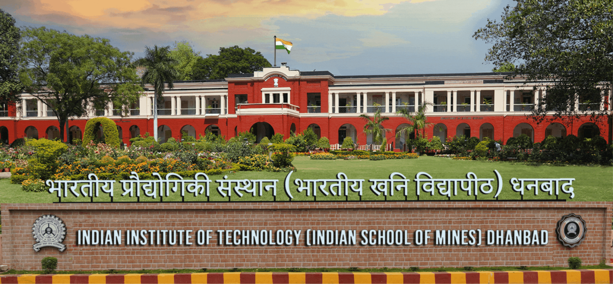

---
format:
  html:
    theme:
      light: flatly
    css: styles.css
    page-layout: full
    toc: false
---

:::::: grid
::: {.g-col-12 .g-col-md-8 .justify-text}
## About Conference

The 1st International Conference on Vibro-acoustic and Mechano-materials (ICVAM-2026) aims to bring together academicians, researchers, students and scientists to exchange novel and innovative ideas, state-of-the-art methodologies, results, and to discuss recent advancements in the broad fields of Vibration, Acoustics, and Mechanics of Materials.

## About IIT(ISM) Dhanbad

Established in 1926, IIT(ISM) Dhanbad is located in India’s coking coal belt, 260 km from Kolkata and 150 km from Ranchi. Spanning 393 acres, it offers world class facilities across 17 departments, providing courses in Engineering, Sciences, Management and Humanities. IIT(ISM) Dhanbad has played a vital role in the growth and development of India’s mining, mineral and petroleum sectors. The institute holds a global rank of 20th and a national rank of 1st in Mineral and Mining Engineering (QS-2025) and an NIRF ranking of 15th in Engineering for the year 2024. To know more about IIT(ISM) Dhanbad, kindly visit IIT(ISM) Dhanbad.

## About the Department

The Department of Mechanical Engineering, established in 1999, has celebrated 25 years of excellence and is the largest department in the institute with 46 faculty members. It offers two undergraduate courses: Mechanical Engineering and Mining Machinery Engineering. Faculty and students collaborate on research in areas like microfluidics, robotics, renewable energy, R&AC, biofluid mechanics, aeroacoustics and more. Students engage in the Robotics Club, Smart Manufacturing, ASME chapter and other professional bodies. The department oversees many R&D projects with student involvement in national and international research and consultancy. To know more about ME department, kindly visit ME, IIT(ISM) Dhanbad.
:::

:::: {.g-col-12 .g-col-md-4}
::: date-box
<h3>Important Dates</h3>

<ul>

<li><strong>Abstract Submission Starts</strong> 15th April, 2026</li>

<li><strong>Abstract Submission Ends</strong> 31st May, 2026</li>

<li><strong>Abstract Acceptance</strong> 7th June, 2026</li>

<li><strong>Full Paper Submission Starts</strong> 15th June, 2026</li>

<li><strong>Full Paper Submission Deadline</strong> 30th July, 2026</li>

<li><strong>Early Bird Registration Starts</strong> 15th August, 2026</li>

<li><strong>Notification of Acceptance</strong> 30th August, 2026</li>

<li><strong>Early Bird Registration Ends</strong> 15th September, 2026</li>

<li><strong>Camera Ready Paper Submission</strong> 21st September, 2026</li>

</ul>
:::
::::
::::::

 

<h2 class="text-center mb-4" style="color: #003366; font-weight: 700;">

Conference Highlights & Campus Tour

</h2>

::::::::::::::: grid
::::: {.g-col-12 .g-col-md-6 .g-col-lg-3}
:::: video-card


::: video-desc
Campus Tour of IIT(ISM)
:::
::::
:::::

::::: {.g-col-12 .g-col-md-6 .g-col-lg-3}
:::: video-card


::: video-desc
Department Overview
:::
::::
:::::

::::: {.g-col-12 .g-col-md-6 .g-col-lg-3}
:::: video-card


::: video-desc
Visionary Partners
:::
::::
:::::

::::: {.g-col-12 .g-col-md-6 .g-col-lg-3}
:::: video-card


::: video-desc
Centenary celebration
:::
::::
:::::
:::::::::::::::
