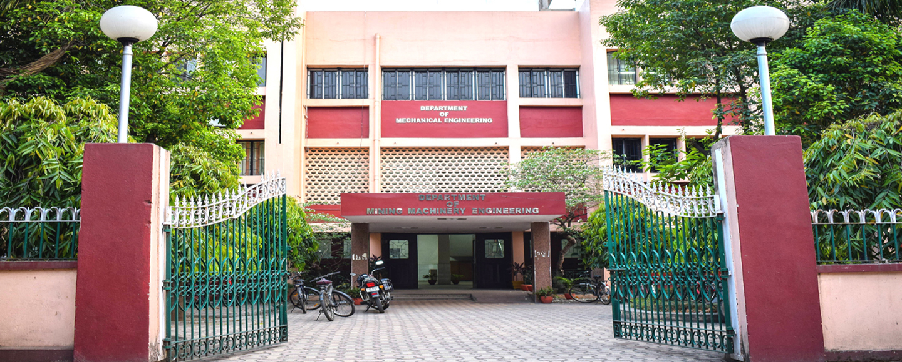

---
format:
  html:
    theme: flatly
    css: styles.css
    page-layout: full
    toc: false
---

::::::: section-spacer
:::::: grid
::: {.g-col-12 .justify-text .mb-2}
<h2 class="fw-bold mb-4">
About the Program
</h2>

An international hybrid workshop and summer school exploring the intersection of physics-based simulation and data-driven methods, organized by the Department of Mechanical Engineering. This five-day event provides a structured platform to master the growing role of data-driven approaches in mechanical engineering. Through a blend of expert-led lectures, tutorial sessions, and hands-on components, participants will explore the mathematical, computational, and practical applications of modern modeling tools.

<strong>Core Topics Include:</strong> Scientific machine learning, computational mechanics, computational fluid dynamics (CFD), reduced-order modeling, digital twins, and high-fidelity simulations.

:::

::: {.g-col-12 .g-col-md-8 .pe-md-4}
<h3 class="fw-bold mt-4 mb-3">
Program Objectives
</h3>

-   **Master Fundamentals:** Understand the core foundations of data-driven modeling in mechanical systems.
-   **Hands-On Training:** Gain practical exposure to scientific machine learning tools and computational workflows.
-   **Integrate Systems:** Learn to seamlessly combine data with simulation, reduced-order models, and physics-based methods.
-   **Global Collaboration:** Build a network with students, researchers, faculty, and industry experts for future national and international collaborations.
:::

::: {.g-col-12 .g-col-md-4 .ps-md-2 .justify}
<h3 class="fw-bold mt-4 mb-3">
Who Should Attend?
</h3>

This hybrid event welcomes \~100 national delegates (in-person) and international delegates (online), including: Students & Research Scholars, Post-Doctoral Fellows, Faculty Members, and Industry Professionals.

<em>Ideal for those interested in the analysis, design, prediction, monitoring, and control of mechanical systems.</em>

<a href="#" class="btn btn-primary btn-lg px-5 py-3 shadow-sm" style="border-radius: 50px; font-weight: 200;">Apply Now</a>
:::
::::::
:::::::

:::::::::: section-spacer
<h2 class="text-center fw-bold mb-5">
Key Takeaways & Benefits
</h2>

::::::::: grid
:::: {.g-col-12 .g-col-md-4}
::: {.card .h-100 .p-4 .bg-light}
<h4 class="fw-bold mb-3">
💡 Knowledge & Skills
</h4>

Develop a working competence in reduced-order modeling, machine learning-assisted simulation, and system identification through targeted lectures and tutorials.
:::
::::

:::: {.g-col-12 .g-col-md-4}
::: {.card .h-100 .p-4 .bg-light}
<h4 class="fw-bold mb-3">
🔬 Research & Academics
</h4>

Identify emerging research problems at the interface of mechanics and data science. Faculty can update course materials, while scholars can accelerate dissertation work and publications.
:::
::::

:::: {.g-col-12 .g-col-md-4}
::: {.card .h-100 .p-4 .bg-light}
<h4 class="fw-bold mb-3">
⚙️ Industry Application
</h4>

Gain actionable insights into deploying data-driven and machine learning tools for real-world monitoring, system prediction, and engineering decision support.
:::
::::
:::::::::
::::::::::

::::::: section-spacer
:::::: grid
::: {.g-col-12 .g-col-md-8 .justify-text}
<h2 class="fw-bold mb-4">
About IIT(ISM) Dhanbad
</h2>

Established in 1926, IIT(ISM) Dhanbad is located in India’s coking coal belt, 260 km from Kolkata and 150 km from Ranchi. Spanning 393 acres, it offers world class facilities across 17 departments, providing courses in Engineering, Sciences, Management and Humanities. IIT(ISM) Dhanbad has played a vital role in the growth and development of India’s mining, mineral and petroleum sectors. The institute holds a global rank of 20th and a national rank of 1st in Mineral and Mining Engineering (QS-2025) and an NIRF ranking of 15th in Engineering for the year 2024. To know more about IIT(ISM) Dhanbad, kindly visit IIT(ISM) Dhanbad.

<h2 class="fw-bold mt-5 mb-4">
About the Department
</h2>

The Department of Mechanical Engineering, established in 1999, has celebrated 25 years of excellence and is the largest department in the institute with 46 faculty members. It offers two undergraduate courses: Mechanical Engineering and Mining Machinery Engineering. Faculty and students collaborate on research in areas like microfluidics, robotics, renewable energy, R&AC, biofluid mechanics, aeroacoustics and more. Students engage in the Robotics Club, Smart Manufacturing, ASME chapter and other professional bodies. The department oversees many R&D projects with student involvement in national and international research and consultancy. To know more about ME department, kindly visit ME, IIT(ISM) Dhanbad.

:::

:::: {.g-col-12 .g-col-md-4}
::: {.card .p-4 .bg-light .h-100}
<h3 class="fw-bold mb-4" style="color: #003366;">
Important Dates
</h3>

<ul class="list-unstyled" style="line-height: 2;">

<li class="mb-2">
<strong>15th April, 2026</strong>  [Abstract Submission Starts]{.text-muted}
</li>

<li class="mb-2">
<strong>31st May, 2026</strong>  [Abstract Submission Ends]{.text-muted}
</li>

<li class="mb-2">
<strong>7th June, 2026</strong>  [Abstract Acceptance]{.text-muted}
</li>

<li class="mb-2">
<strong>15th June, 2026</strong>  [Full Paper Submission Starts]{.text-muted}
</li>

<li class="mb-2">
<strong>30th July, 2026</strong>  [Full Paper Submission Deadline]{.text-muted}
</li>

<li class="mb-2">
<strong>15th August, 2026</strong>  [Early Bird Registration Starts]{.text-muted}
</li>

<li class="mb-2">
<strong>30th August, 2026</strong>  [Notification of Acceptance]{.text-muted}
</li>

<li class="mb-2">
<strong>15th September, 2026</strong>  [Early Bird Registration Ends]{.text-muted}
</li>

<li class="mb-2">
<strong>21st September, 2026</strong>  [Camera Ready Paper Submission]{.text-muted}
</li>

</ul>
:::
::::
::::::
:::::::

:::::::::::::::: section-spacer
<h2 class="text-center fw-bold mb-5" style="color: #111111;">
Event Highlights & Campus Tour
</h2>

::::::::::::::: grid
::::: {.g-col-12 .g-col-md-6 .g-col-lg-3}
:::: {.video-card .card .p-0 .overflow-hidden .border-0 .shadow-sm}


::: {.video-desc .p-3 .text-center .fw-bold .bg-light}
Campus Tour of IIT(ISM)
:::
::::
:::::

::::: {.g-col-12 .g-col-md-6 .g-col-lg-3}
:::: {.video-card .card .p-0 .overflow-hidden .border-0 .shadow-sm}


::: {.video-desc .p-3 .text-center .fw-bold .bg-light}
Department Overview
:::
::::
:::::

::::: {.g-col-12 .g-col-md-6 .g-col-lg-3}
:::: {.video-card .card .p-0 .overflow-hidden .border-0 .shadow-sm}


::: {.video-desc .p-3 .text-center .fw-bold .bg-light}
Visionary Partners
:::
::::
:::::

::::: {.g-col-12 .g-col-md-6 .g-col-lg-3}
:::: {.video-card .card .p-0 .overflow-hidden .border-0 .shadow-sm}


::: {.video-desc .p-3 .text-center .fw-bold .bg-light}
Centenary Celebration
:::
::::
:::::
:::::::::::::::
::::::::::::::::
